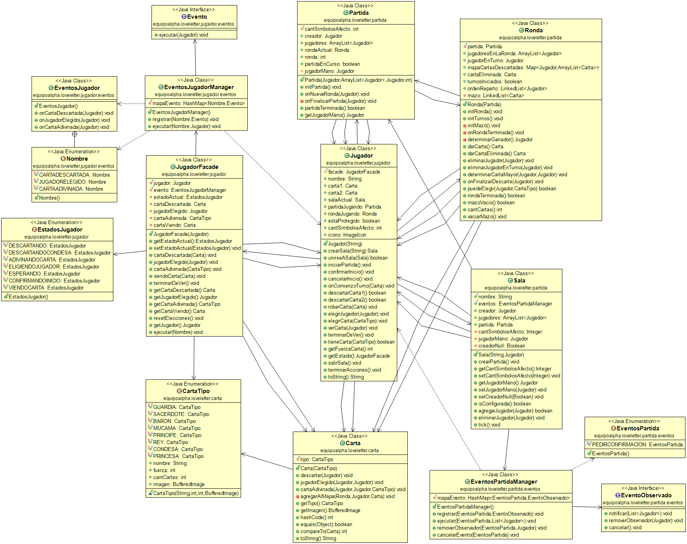

# Love Letters

## Introducción

Proyecto de java para el taller de calificación profesional de la materia *Programacion Avanzada* de la *Universidad Nacional de la Matanza*.

[LoveLetter](https://en.wikipedia.org/wiki/Love_Letter_(card_game)) es un juego de cartas para 2-4 personas.

#### Consignas:
 
Las consignas se encuentran en el repositorio de la materia [aqui](https://github.com/programacion-avanzada/2020b)

## Integrantes

  - [Ramiro Valle](https://github.com/RamiroValle)
  - [Kevin Niedfeld](https://github.com/KevinNied)
  - [Santiago Giasone](https://github.com/santiagogiasone)
  - [Nicolás muryn](https://github.com/NicolasPablo)
  - [Ignacio arias](https://github.com/NachoArias)
  - [Santiago Vasquez](https://github.com/SantiiVasquez)
  - [Matías Ramirez](https://github.com/matigastirami)
  
 ## Diagrama de Clases
 
 